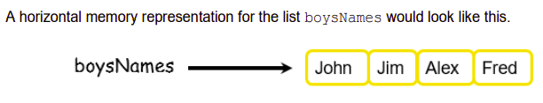
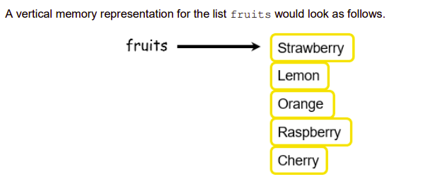

# Creating a List 📚

- The code shown below creates five different empty lists. The square brackets on the right hand side of each assignment tell Python that the datatype of the variable named on the left 
hand side is a list.

````py
# Lists can be initially empty

boysNames = []
girlsNames = []
favouriteSongs = []
fruits = []
vehicleCount = []
accountDetails = []
````

- Even though these lists do not contain any data, their construction means that the program can add data to them at a later stage.

💡Remember lists are *mutable*.

This means that values can be *added, deleted or simply 
changed* after the list has been created. 

- The following code snippet illustrates how to initialise lists with data.


````py
# Lists can be created with data (each value is a list element)

boysNames = ['John', 'Jim', 'Alex', 'Fred']
girlsNames = ['Sarah', 'Alex', 'Pat', 'Mary']
favouriteSongs = ['Moondance', 'Linger', 'Stairway to Heaven']
fruits = ['Strawberry', 'Lemon', 'Orange', 'Raspberry', 'Cherry']
vehicleCount = [0, 0, 0, 0, 0, 0]
accountDetails = [1234, 'xyz', 'Alex', '1 Main Street', 827.56]
````

💡 Notice also that ``boysNames, girlsNames, favouriteSongs`` and ``fruits`` are all lists of *strings*

``vehicleCount`` is a list of *numbers*

And ``accountDetails`` is a list of values that have a mixture of different underlying datatypes.

## Visualisation

- One of the key differences between lists and traditional arrays used in other programming languages is that a Python lists can be made up of data having a mixture of different datatypes, whereas the elements of an array must all be of the same data type. 

- It is useful to form a mental image of how lists are represented internally by the computer.
- Lists are frequently depicted in either a *horizontal* or *vertical* fashion as shown here.

Horizontal:



Vertical:


The key point is that the elements of the list should be envisaged in neighbouring memory locations *(just like the individual characters of a string as described in the previous section)*.

## Task 1
✍ In your copy, list 5 things you have learned about *Lists* so far.


