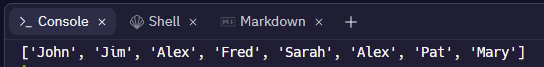

# Common List Operations 📚

- Because lists and strings are both sequences, all of the common basic operations work in the same way for *lists* as they do for *strings*. 

- Specifically, lists can be added to one another 
*(concatenation), multiplied together, indexed and sliced*.

- The commands ``min``, ``max``, and ``len`` also work for lists in the same way as they do for strings returning the *minimum value*, the *maximum value* and the *number of elements* (i.e. the length) in the list respectively.

## Task 2
👉 In `main.py` select one of the lists from *Part 2* and use the `min`, `max` and `len` commands on it.


## Concatenation & Lists
Lists can also be constructed by concatenating two existing lists together. For example, we could join ``boysNames`` and ``girlsNames`` together using the concatenation operator ``+`` to 
form a new list called ``names`` as follows.

````py 
# Concatenate two lists and store the result in a new list

boysNames = ['John', 'Jim', 'Alex', 'Fred']
girlsNames = ['Sarah', 'Alex', 'Pat', 'Mary']
names = boysNames + girlsNames
print(names)
````

💡 Notice that square brackets are not used on line 3.

- When a list is used without square brackets like this, Python takes it that every element in the list is to be used. 
The ``print`` command on line 4 displays the entire contents of the list. The output generated by the above code is shown here.

 


## Extending a List
- The example below generates the exact same output, while demonstrating that concatenation does not always result in a new list being created.
  
- The list, ``boysNames`` is extended to include the list of girls’ names.

````py
# Concatenate two lists by extending one of them

boysNames = ['John', 'Jim', 'Alex', 'Fred']
girlsNames = ['Sarah', 'Alex', 'Pat', 'Mary']
boysNames = boysNames + girlsNames
print(boysNames)

# NOTE: Just because the above list is called 'boysNames'
# does not mean that girls' names cannot be stored in it.
````


