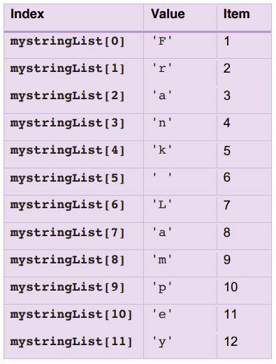

# Indexing Lists 📚

Although a string and a list are different variable types, items in lists are indexed in the same way as in strings. 

- Recall from the section on strings, that indexing is a technique used to access individual elements of a list.

- List indexing works just like string indexing. A list element is accessed by using an index which is a *zero-based* positional value for that element. As was the case with strings, the index must be an integer (or an expression that evaluates to an integer), and, must be enclosed inside square brackets, i.e. ``myList[0]``

## Task 1
👉 Let’s continue the example from *5.1 - Lists*, using the list ``myStringList``:
````py
myStringList = ['F', 'r', 'a','n', 'k', ' ', 'L', 'a', 'm', 'p', 'e', 'y']
````

The following table shows the index of each item in the list, and its value.



- Using the table above, we can print out single items from the list, say item 2, 4 and 7 by adding the following:
````py
print(myStringList[1])
print(myStringList[3])
print(myStringList[6])
````
The output should now include these lines:
````
r
n
L
````
- We can also refer to a section of a list, e.g. from item 3 to item 7, inclusive (just like with strings).

- Add this line to your code:
````py
print(myStringList[2:8])
````

💡 Note that this returns a list.

This line is now included in the output:
````
['a', 'n', 'k', ' ', 'L']
````

