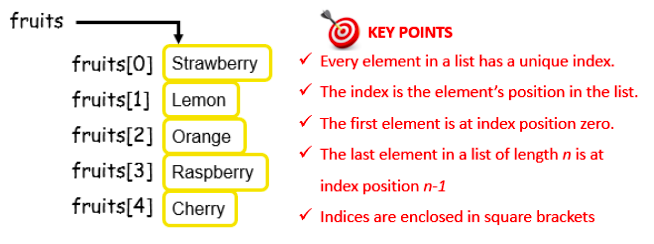

# Fruit Machine 👨‍💻

The graphic below depicts how index numbers can be ncluded as part of the *‘mental image’* we formed for lists earlier.



Every list element is uniquely referenced by the list name and an index number.

## Fruit Machine - Sample Program

The next example program demonstrates how to combine the use of random numbers and lists to simulate the operation of an arcade fruit machine.

### Predict
👉 Read the program carefully and see if you can figure out how it works.

### Run
👉 Code it up in `main.py` and see if your predictions are correct.

````py
# Program to simulate a fruit machine!
import random

# initialise the list of fruits - 5 elements
fruits = ['Strawberry', 'Lemon', 'Orange', 'Raspberry', 'Cherry']

# generate three random numbers between 0 and 4 incl.
selection1 = random.randint(0, 4)
selection2 = random.randint(0, 4)
selection3 = random.randint(0, 4)

# show the results - display the fruits
print(fruits[selection1])
print(fruits[selection2])
print(fruits[selection3])
````


