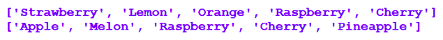

# Changing the value of list elements 📚

Lists are *mutable* objects. 

- This means that the elements of a list can be changed (as well as accessed). 

- Recall that this is not possible with strings because they are immutable. 

- It is therefore ‘legal’ to apply the index operator to a list variable on the left hand side of an assignment statement. 

## Task 2
The following short program demonstrates this.

````py
# A program to demonstrate how to change the contents of a list

fruits = ['Strawberry', 'Lemon', 'Orange', 'Raspberry', 'Cherry']
print(fruits)

fruits[0] = 'Apple'
fruit = 'Melon'
fruits[1] = fruit
fruits[2] = 'Raspberry'
fruits[3] = fruits[4]
fruits[4] = 'Pineapple'

print(fruits)
````
### Predict
✍ Study the program above and in your copy try to predict the output of the program.

### Run
- Type the program shown above into `Thonny` and see if your prediction was correct.

<details>
  <summary> 👀 Hint </summary>

Line 1 initialises a list of fruits and line 2 displays the contents of the list.

Lines 4-9, each make separate changes to the individual elements in the list that are ‘housed’ at the given index
Line 11 displays the list again.
</details>

<details>
  <summary> Solution </summary>
  
  
  
</details>

>


