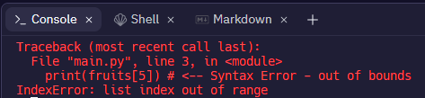

# Index ‘Out of Range’ Errors 📚

At runtime, Python always checks that index numbers lie within bounds for the object they are being used to access. 

A list index will be *"out of bounds"* if it lies beyond the range of the list. 
If Python attempts to access a list element using an index that is out of bounds, it returns an out of range index error and the program will crash... *i.e. stop functioning*.

**💡Note:** The whole idea of testing is to safeguard against system crashes happening in live (production) code.

## Task 3

````py
# Initialise a list of 5 fruits and try to access the 6th one

fruits = ['Strawberry', 'Lemon', 'Orange', 'Raspberry', 'Cherry']
print(fruits[5]) # <-- Syntax Error - out of bounds

# Question: Why will the following lines not be executed?
print("Hello World") 
lifeSupport = True

# Answer: Because Python stops when it encounters a syntax error.
````

👉 Run the code and you will see that it crashes on line 3, and lines 6 and 7 never get executed. 



💡 By now you're probably starting to notice that programmers spend much of their time correcting their own syntax errors! 😫

