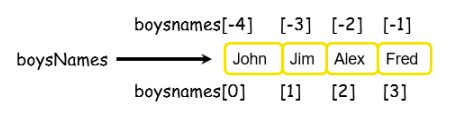

# Negative indices 

These can be used on lists in just the same way as they could be used on strings. 

The last element of a Python list has an index of ``−1``. Working backwards, the index of each element is one less than its predecessor. 

Therefore, the valid indices for a list made up of four elements would be ``[−4] -> [-1]`` or ``[0] -> [3]`` inclusive. 

This is illustrated below.



## Task 4
👉 Can you use negative indexing to access elements of the List on the previous page.

````py
fruits = ['Strawberry', 'Lemon', 'Orange', 'Raspberry', 'Cherry']


````
👉 Add lines to the code above to print the 1st and 3rd element of the list using *negative indexing*.


<details>
  <summary> 👀 Hint </summary>

````py  
  fruits[-5]
````

</details>


>