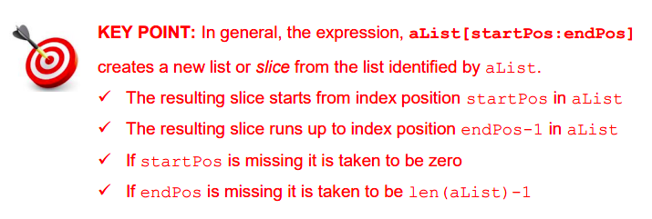

# List Slicing 📚

- Lists can be quite long and sometimes we might just be interested in processing a portion of the data they contain. 
- We can extract sub-lists from lists using the exact same technique that 
we used to extract substrings from strings earlier *i.e. slicing.*
- A slice is a list of consecutive elements taken from another (larger) list.
- Slices are created using the square brackets index operator `[ ]`.
- As was the case with strings, the colon `:` delimits the start and end positions of the slice we are interested in extracting.

The technique of slicing is demonstrated in the program below:

````py
# A program to demonstrate list slicing
fruits = ['apple', 'pear', 'orange', 'banana', 'kiwi']

print(fruits[1:3])  # ['pear', 'orange']
print(fruits[2:4])  # ['orange', 'banana']
print(fruits[2:5])  # ['orange', 'banana', 'kiwi']

print(fruits[1:])   # ['pear', 'orange', 'banana', 'kiwi']
print(fruits[:5])   # ['apple', 'pear', 'orange', 'banana', 'kiwi']
````
👉 Can you figure out how the program generates the output shown 
inside the comments? 

👉 How could we ‘slice out’ the fruits that grow in Ireland?

💡*Note: The slice is taken from the start position up to, but not including, the last position.*

- For example, the slice created by ``fruits[2:5]`` starts at position 2 and continues up to, but not including, position 5 *i.e. from position 2 to 4 inclusive.*

- If the first position is not specified it is taken to be zero, and if the last position is not specified it is taken to be the length of the list.

## Slicing creates a new list.
It is worth emphasising the point that a slice is in fact a new list. 
For example, the following code results in the new list being stored in the list variable ``exoticFruits``.

The slice is from element 2 to 4 inclusive.
````py
# Slicing creates a new list
fruits = ['apple', 'pear', 'orange', 'banana', 'kiwi']
exoticFruits = fruits[2:5]
print(exoticFruits)
````
- When this program is run the contents of exoticFruits are displayed i.e. ``['orange', 'banana', 'kiwi']``.
- Finally, it is also worth noting that Python does not display a syntax error when the end position specified in the slice exceeds the number of elements in the list.
- In such situations Python just slices up to the last element of the list.
- Therefore, the result of the following code will be the exact same as the code shown above.

````py
fruits = ['apple', 'pear', 'orange', 'banana', 'kiwi']
exoticFruits = fruits[2:15]
print(exoticFruits)
````



