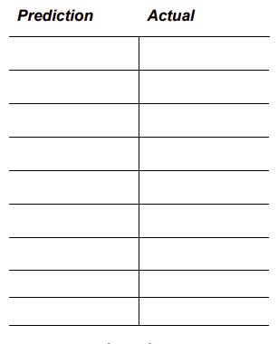

# Slicing - Task 👨‍💻

## Predict & Run 
Let’s say we have the following list initialisation.

````py
fruits = ['Strawberry', 'Lemon', 'Orange', 'Raspberry', 'Cherry']
````
- Predict the output that would be displayed by each of the print statements in the program snippet below.


````py
print(fruits[0])
print(fruits[3])
print(fruits[2])
print(fruits[len(fruits)-1])
print(fruits[1])

fruit = fruits[2+2]
print(fruit)
print(fruit[0])

orange = fruits[1]
print(orange)
lemon = fruits[1]
print(lemon)

````
- ✍ Record your predictions in the left column.

  

- Now copy the sample code above into `main.py` and check your predictions.

## ✨Extra Credit
- What do you think the following expression would generate?
````py
print(fruits[0][0]+fruits[1][0]+fruits[2][0])
````

- How does this answer shape your thinking in terms of the relationship 
between strings and lists?