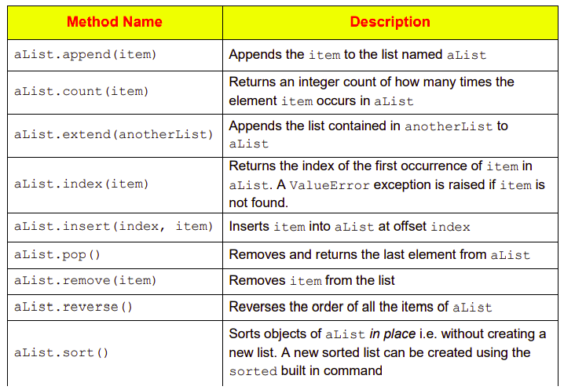
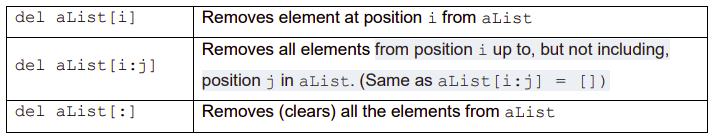

# List Methods 📚

- As data structures go, lists are very flexible.
- Apart from the basic common operations that can be carried out on all sequences *(e.g. concatenation, indexing, slicing)*, list objects also support a variety of additional type-specific commands *(methods)*. 

- The table below introduces some of these



- The ``del`` keyword can also be applied to remove individual elements or entire slices from a lists.
- ``del`` is used in conjunction with the square bracket index operator ``[i]`` as follows:



## List Methods - Task 👨‍💻
- The following program demonstrates the use of several of these *"type-specific"* commands.
- The generated output is shown as a ``# comment`` at the end of the 1st ``print`` statement. You should read through the code and try to understand & *"predict"* the list methods used.

````py
# A short program to demonstrate the use of list specific methods
fruits = ['pear', 'apple', 'orange', 'banana', 'kiwi']
fruit = 'apple'
vegs = ['peas', 'carrots']


fruits.append(fruit)
print(fruits) # ['pear', 'apple', 'orange', 'banana', 'kiwi', 'apple']

fruits.extend(vegs)
print(fruits) # Predict ouput

fruits.insert(2, fruit)
print(fruits) # Predict ouput

fruits.pop()
print(fruits) # Predict ouput

fruits.remove(fruit)
print(fruits) # Predict ouput

fruits.reverse()
print(fruits) # Predict ouput

fruits.sort()
print(fruits) # Predict ouput

print(fruits.index(fruit)) # Predict ouput
print(fruits.count(fruit)) # Predict ouput
````

💡 *Please Note:*
- The same dot notation as was described for string methods is also used for lists. 
- This means in order to use a list method, the programmer must type the name of the list variable followed by a dot, followed by the method’s name.
````
<list-variable-name>.<method-name>
````
````py
fruits.append()
fruits.sort()
fruits.reverse()

etc...
````

# ✨ Extra Credit
- Create 2 new list of your own, `animals = []` and `colours = []`.
- Experiment using the *"list methods"* outlined in the table above.
